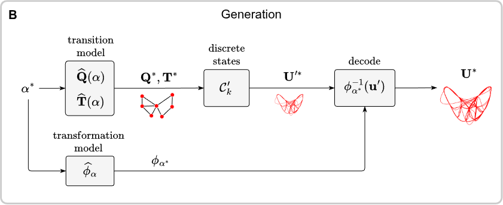

### Control-oriented cluster-based reduced-order model (CNMc)

Refer to the accompanying paper for the algorithm description:
- P. Olivucci, D. E. Rival and R. Semaan "Control-oriented cluster-based reduced-order modelling" (2026) https://arxiv.org/abs/2604.25474 

Lorenz data for use in `experiments/lorenz63` can be downloaded from https://doi.org/10.5281/zenodo.19450335

#### Installation notes
The package has been tested on Python 3.10.12.
The required dependencies can be installed via 

`pip install -r requirements.txt`.